

  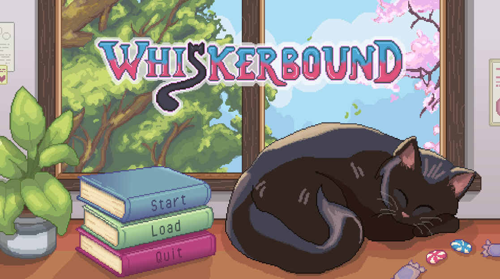

# Whiskerbound

A 2D top-down pixel-art adventure for mobile, built in Unity. Two characters, one cat, and a candy-colored kingdom that isn't as sweet as it looks.

**[Download the Android build](https://github.com/jana-levanza/Whiskerbound/releases/latest)**

   
  Scan to download the Android demo

---

## Why we made this

Whiskerbound is the first game we've ever made, and we made it as third-year BSIT students. Finishing it, with a full win and lose condition, cutscenes and a world we're proud of, made us want to keep going in game development.

It started with a cat. Neela, the cat in the game, is inspired by my own cat, **Kwintas**, and by how much the five of us love cats. Our first question was simple: what would it feel like if someone you love was taken, and you had to climb a whole kingdom to get them back?

Two other things shaped it:

- **Fireboy and Watergirl.** We loved how two characters with different strengths have to work together. That became Yoichi and Shuyi, and the character-switching at the center of the game.
- **Filipino candies.** The two main characters are inspired by **Monami** candy. The villagers and other NPCs come from **V-Fresh, Champi, Opuff, Lala, Wiggles and Potchi**. We wanted the world to look sweet and familiar, and then let the story underneath be much darker.

<!-- Optional: add a photo of Kwintas next to the Neela art, with a caption. -->

## About the game

Yoichi and Shuyi are pulled into a magical storybook along with Neela. The book's world is a towering fantasy kingdom shaped like a mountain, and the beads from Neela's collar are the only thing that can guide them up to the castle at the top.

You play both characters and switch between them on the fly. Yoichi is the warrior: he fights, shields and handles anything that needs strength. Shuyi is the mage: she handles magic and most of the puzzles. Almost every room needs both of them.

Each level asks you to explore, solve a puzzle, fight what's in your way, and collect the beads hidden around the map.

This is a **playable demo**. You win by finishing the maze puzzle and collecting all the beads. You lose when your health runs out.

## The team

A five-person project for our BSIT course, 3rd year.

| Name | Role |
|---|---|
| **Jana P. Levanza** | Project Manager, Level Designer, 2D Artist, Concept Artist |
| **John Rick S. Mabalot** | Game Designer, Gameplay Programmer, QA Tester |
| **Kimberly A. Legaspi** | Narrative Writer, Sound designer |
| **Kate Czarina G. Villareal** | Narrative Writer, Sound Designer |
| **Lyanna Arquil G. Magtuloy** | Narrative Writer, Sound Designer |

### My part

I managed the team, and I made the art and the levels.

- Concept art and pixel art for all the characters and buildings
- Every scene and level in the game: layouts, puzzles, bead hiding spots and enemy placement
- The schedule and task planning for five people

John Rick designed the game and programmed the gameplay: character switching, combat, puzzles, the bead and altar logic and the touch controls. He also tested the builds. Kimberly, Kate and Lyanna wrote the narrative and made the music and sound effects.

Some of the tilesets came from free online asset packs. They're listed in the credits below.

## Design notes

**Buildings.** I was inspired by backyard mini houses for fairies, the tiny, handmade kind you'd find in a garden. Then I gave them my own twist by adding candy and chocolate details, so the village looks like something you could almost eat.

**Characters.** The main characters are based on Monami candy, and each NPC takes its look from a different Filipino sweet. I sketched them as concept art first, then drew the final pixel sprites in Aseprite.

**Level design.** This was my favorite part of the whole project. I loved building the puzzles, finding clever places to hide the beads, and deciding where enemies should stand so a room feels fair but not easy. Levels are semi-linear with side paths and village hubs, and later ones give the player less guidance.

<!-- Add a level-sketch vs final-screenshot comparison here. -->

## Screenshots

| | |
|---|---|
| 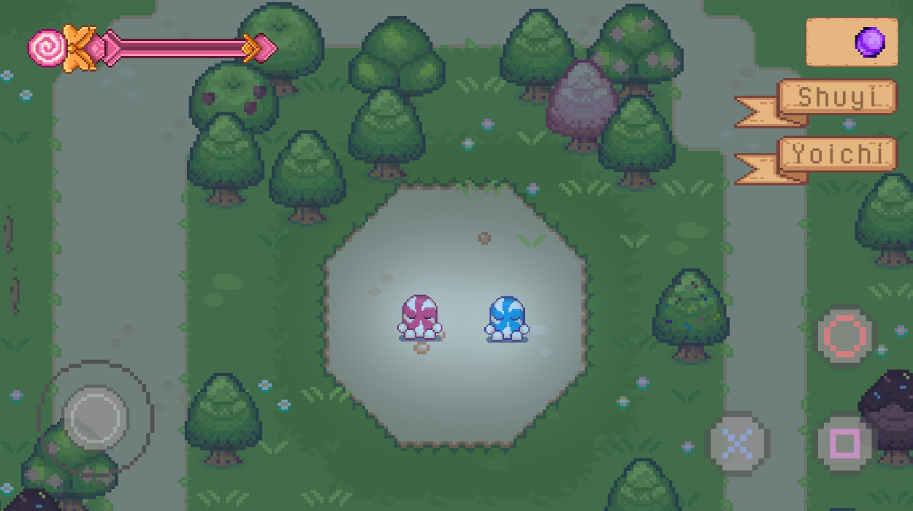 | 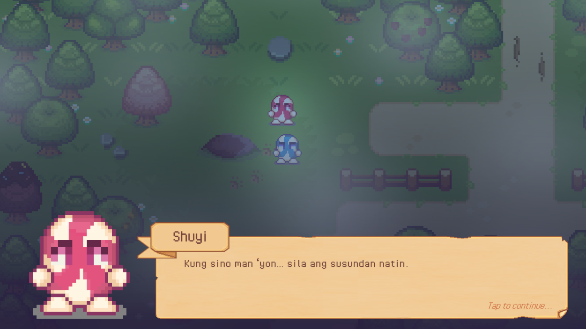 |
| 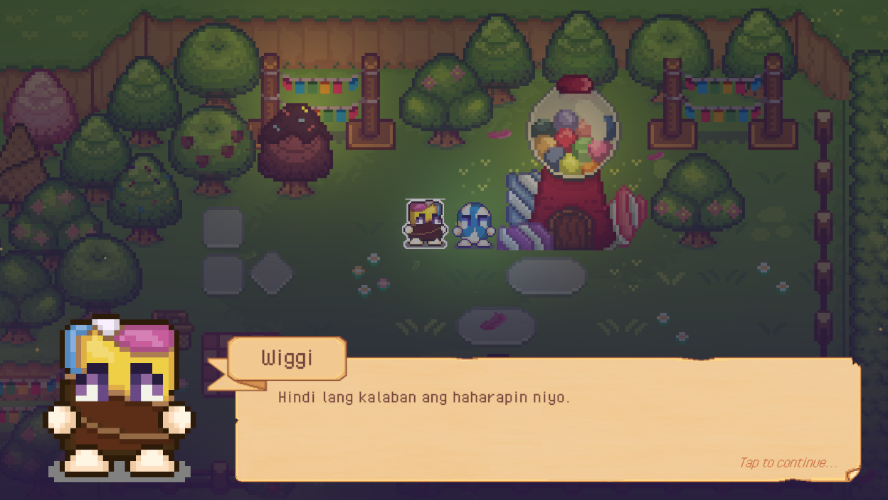 | 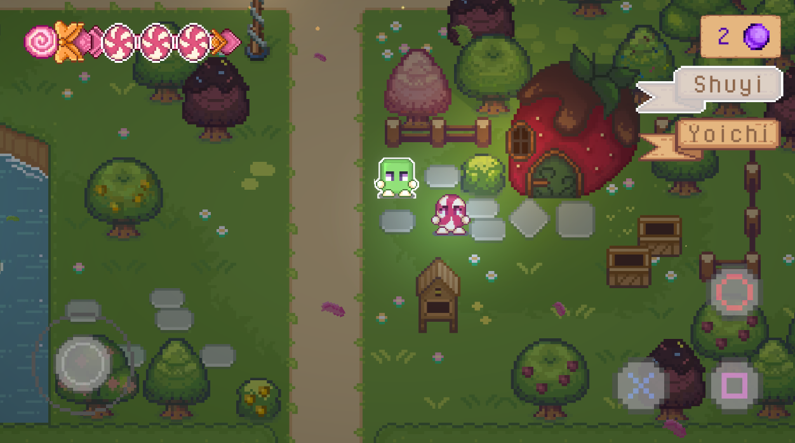 |
| 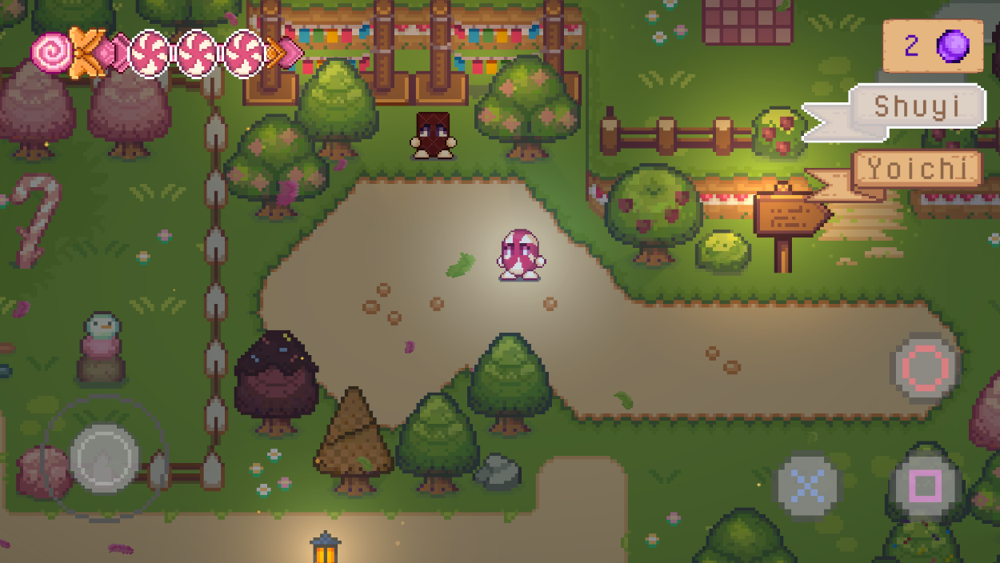 | 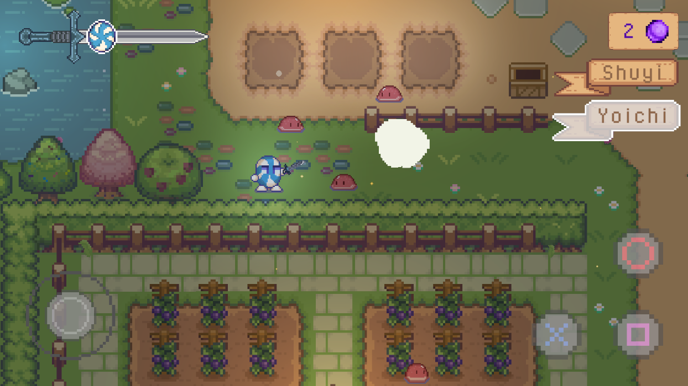 |
| 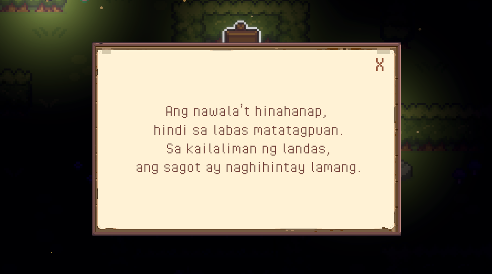 | 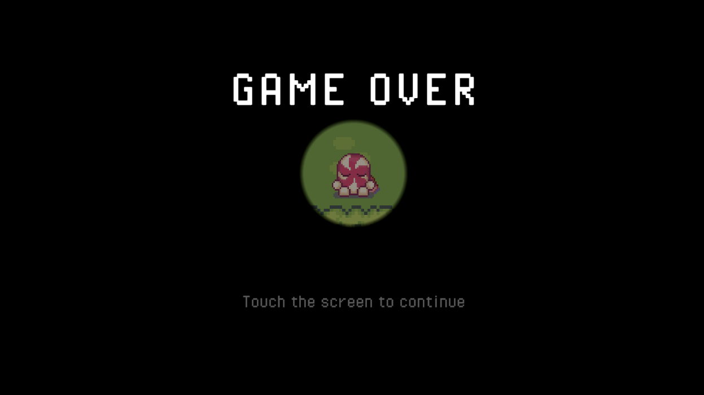 |

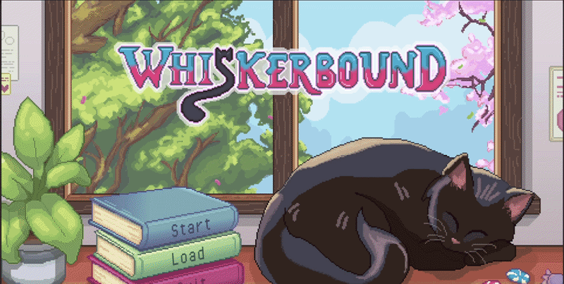
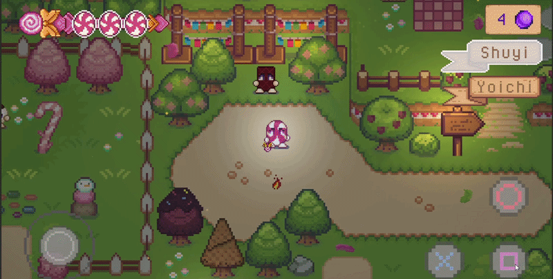
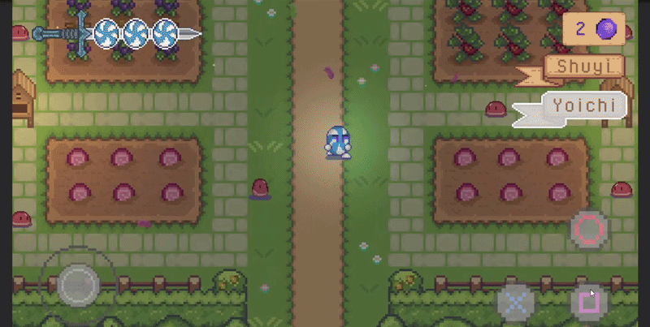

## Art process

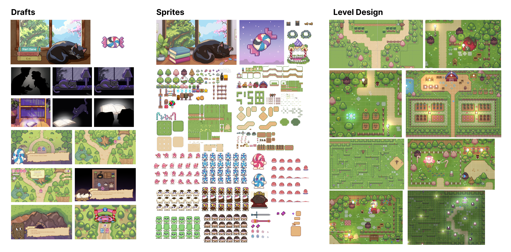

<!-- Add your building concepts, character concepts and one before/after iteration here. -->

## Pre-production

Before building anything, we planned the game in a design document and a storyboard.

- [Game design document (PDF)](Docs/Whiskerbound_GDD.pdf)
- [Storyboard on Canva](https://canva.link/v868pezap4v8z6a)
- [Storyboard documentation (PDF)](Docs/storyboard/storyboard-documentation.pdf)

  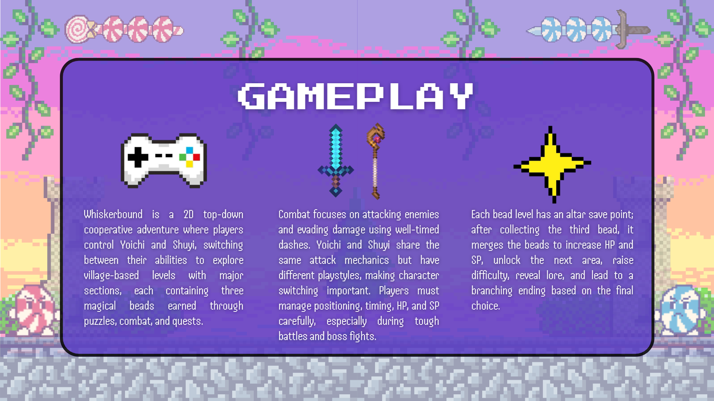

## Tech

- Engine: Unity 6.3 LTS (6000.3.4f1), 2D
- Target: Android, with an on-screen joystick and action buttons
- Art tools: Aseprite, ibisPaint, Figma
- Source art is in `ArtSource/` (tracked with Git LFS)

## Running it

**Play the build:** download the APK from the [Releases](YOUR_RELEASES_LINK) page and install it on an Android device.

**Open the project:**
1. Install Unity 6.3 LTS (6000.3.4f1) through Unity Hub.
2. Run `git lfs install`, then clone the repo.
3. Add the project in Unity Hub and open it.
4. Open `Assets/Scenes/[YOUR_MAIN_SCENE].unity` and press Play.

## What's next

We plan to keep building this after the course ends:

- Expand the story and lore
- Add more levels and maps
- Finish the full story arc from the design document
- Better accessibility options, like remappable controls and a colorblind mode

## Credits

- **Jana P. Levanza**: project management, level design, 2D art, concept art
- **John Rick S. Mabalot**: game design, gameplay programming, QA testing
- **Kimberly A. Legaspi**, **Kate Czarina G. Villareal** and **Lyanna Arquil G. Magtuloy**: narrative writing and sound design
- Tilesets: Sprout Lands by Cup Nooble https://cupnooble.itch.io/

Thank you to Kwintas, for the idea.
